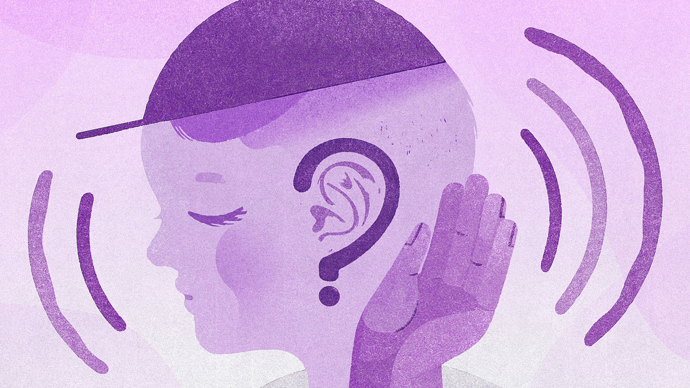
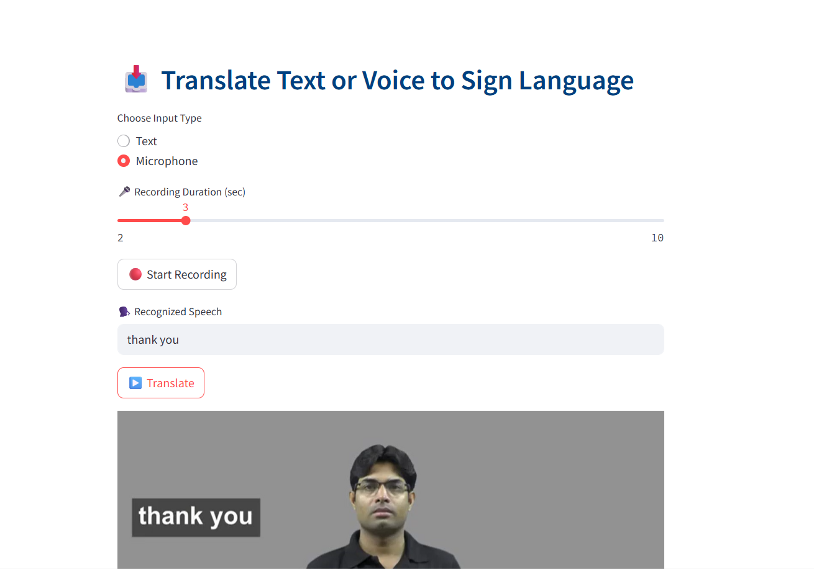
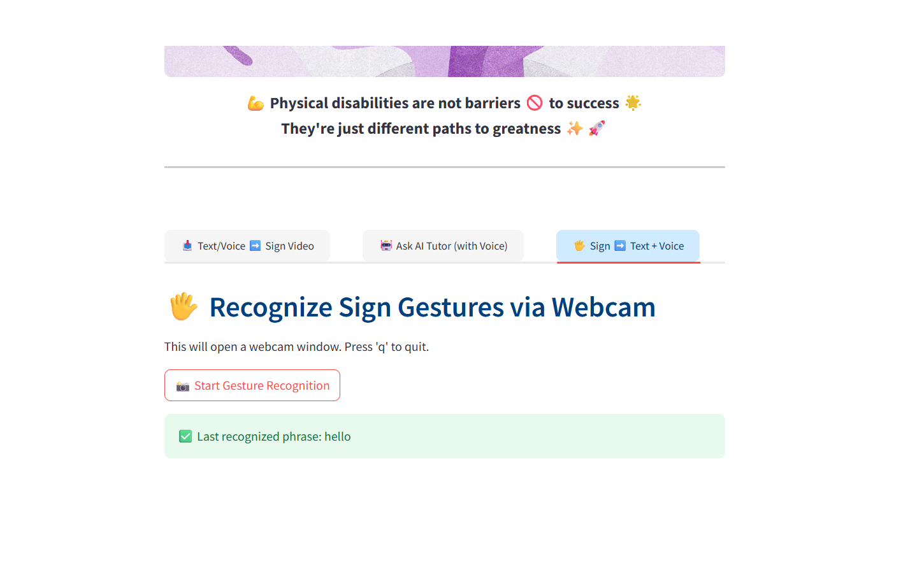

# 🧏‍♀️ AI SignLang Tutor – Breaking Barriers with Inclusive AI

> Empowering deaf learners with real-time Sign Language translation, voice interaction, and AI tutoring using Indian Sign Language (ISL).



---

## ✨ Overview

**AI SignLang Tutor** is an educational tool built to help bridge communication gaps for the **deaf and hard-of-hearing community**. It translates between **text/voice and Indian Sign Language (ISL)** and includes a simulated **AI tutor** experience using **Amazon Q logic**, voice synthesis, and real-time gesture recognition.

This project was developed for the [AWS Breaking Barriers Hackathon 2025](https://devpost.com/...), where the focus is on building **inclusive applications powered by AWS Generative AI + next-gen connectivity**.

---

## 🧠 Key Features

| Feature                         | Description                                                                 |
|---------------------------------|-----------------------------------------------------------------------------|
| 🗣️ Text/Voice ➡️ ISL Video        | Input spoken or written phrases and get the matching ISL video.            |
| 🤖 Ask AI Tutor (Amazon Q logic) | Ask about common signs (colors, family, greetings, etc.) with voice output |
| 🖐️ Sign ➡️ Text + Voice (Reverse) | Perform gestures via webcam and receive recognized text + spoken response  |
| 📶 Edge + 5G Ready              | Designed to run on low-power edge devices with real-time webcam input.     |
| 🌍 ISL-first, scalable globally | Built for Indian Sign Language but can be extended to ASL, BSL, etc.       |

---

## 🚀 Tech Stack

- **Frontend**: [Streamlit](https://streamlit.io/)
- **Backend AI Logic**: Amazon Q Developer (simulated)
- **Voice Input**: `speech_recognition`, `sounddevice`
- **Voice Output**: `pyttsx3`
- **Gesture Recognition**: `MediaPipe`, `OpenCV`, `TensorFlow`
- **Data**: Custom ISL dataset (hello, how are you, thank you)
- **Deployment**: Local environment (Edge/5G capable)

---

## 📸 Screenshots

| Text/Voice to Sign | Ask AI Tutor | Sign to Voice |
|--------------------|--------------|----------------|
|  |  |  |

---

## 🎥 Demo Video

> 📽️ [Watch the 5-minute project demo on YouTube](https://www.youtube.com/...)  
> 🔊 Covers UI flow, AWS logic, webcam-based gesture recognition, and accessibility

---

## 🧩 Example AI Tutor Prompts

| Question                  | AI Response (ISL explanation)                               |
|--------------------------|-------------------------------------------------------------|
| How to sign “hello”?     | Salute starting from the forehead.                         |
| What is the sign for “father”? | Thumb touches forehead with fingers spread.                |
| How to sign “thank you”? | Fingers at chin, move forward like blowing a kiss.         |
| How to sign “red”?       | Brush index finger down lips.                              |
| What is the ISL for “friend”? | Hook both index fingers together in both directions.      |

---

## 🌈 Accessibility Impact

- **Over 63 million deaf and hard-of-hearing people in India alone** face educational and communication barriers.
- This project brings **accessible AI-powered translation**, **interactive voice tutors**, and **real-time gesture support** for ISL.
- The modular system allows educators to expand phrases and personalize content.

---

## 🧱 Architecture

```mermaid
graph TD
A[User Input: Text/Voice/Webcam] --> B[Streamlit UI]
B --> C[Amazon Q Logic (Simulated)]
B --> D[Sign Video Renderer]
B --> E[Gesture Classifier (TF + MediaPipe)]
E --> F[Text & Voice Output Engine]
