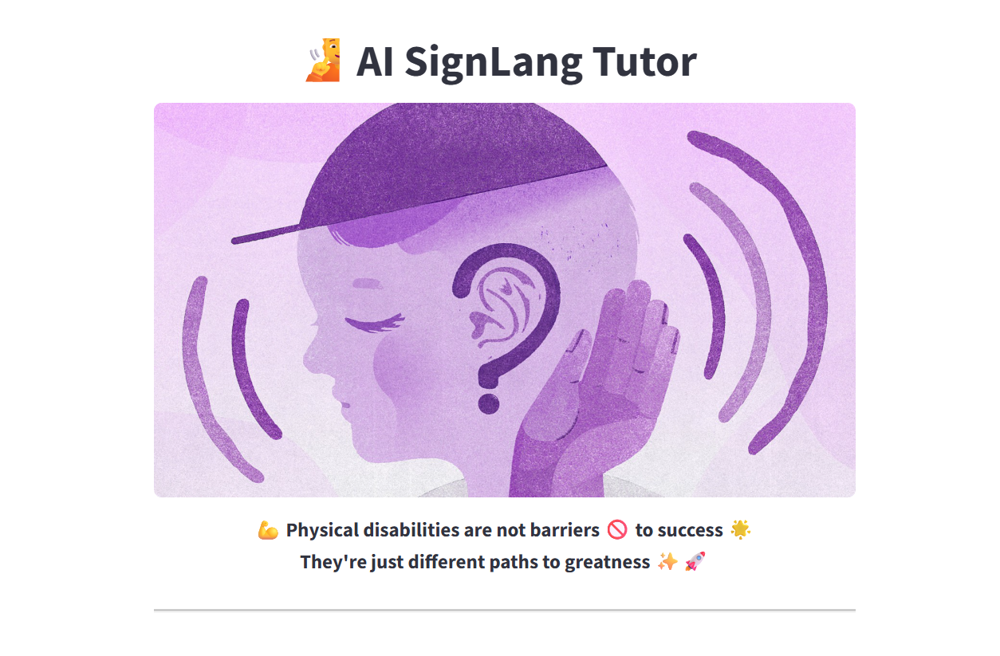

# 🧏‍♀️ AI SignLang Tutor – Breaking Barriers with Inclusive AI

> Empowering deaf learners with real-time Sign Language translation, voice interaction, and AI tutoring using Indian Sign Language (ISL).



---

## ✨ Overview

**AI SignLang Tutor** is an educational tool built to help bridge communication gaps for the **deaf and hard-of-hearing community**. It translates between **text/voice and Indian Sign Language (ISL)** and includes a simulated **AI tutor** experience using **Amazon Q logic**, voice synthesis, and real-time gesture recognition.

This project was developed for the [AWS Breaking Barriers Hackathon 2025](https://devpost.com/...), where the focus is on building **inclusive applications powered by AWS Generative AI + next-gen connectivity**.

---

## 🧠 Key Features

| Feature                         | Description                                                                 |
|---------------------------------|-----------------------------------------------------------------------------|
| 🗣️ Text/Voice ➡️ ISL Video        | Input spoken or written phrases and get the matching ISL video.            |
| 🤖 Ask AI Tutor (Amazon Q logic) | Ask about common signs (colors, family, greetings, etc.) with voice output |
| 🖐️ Sign ➡️ Text + Voice (Reverse) | Perform gestures via webcam and receive recognized text + spoken response  |
| 📶 Edge + 5G Ready              | Designed to run on low-power edge devices with real-time webcam input.     |
| 🌍 ISL-first, scalable globally | Built for Indian Sign Language but can be extended to ASL, BSL, etc.       |

---

## 🚀 Tech Stack

- **Frontend**: [Streamlit](https://streamlit.io/)
- **Backend AI Logic**: Amazon Q Developer (simulated)
- **Voice Input**: `speech_recognition`, `sounddevice`
- **Voice Output**: `pyttsx3`
- **Gesture Recognition**: `MediaPipe`, `OpenCV`, `TensorFlow`
- **Data**: Custom ISL dataset (hello, how are you, thank you)
- **Deployment**: Local environment (Edge/5G capable)

---

## 📸 Screenshots

| Text/Voice to Sign | Ask AI Tutor | Sign to Voice |
|--------------------|--------------|----------------|
|  |  |  |

---

## 🎥 Demo Video

> 📽️ [Watch the 5-minute project demo on YouTube](https://www.youtube.com/...)  
> 🔊 Covers UI flow, AWS logic, webcam-based gesture recognition, and accessibility

---

## 🧩 Example AI Tutor Prompts

| Question                  | AI Response (ISL explanation)                               |
|--------------------------|-------------------------------------------------------------|
| How to sign “hello”?     | Salute starting from the forehead.                         |
| How to sign  “father”? | Thumb touches forehead with fingers spread.                |
| How to sign “thank you”? | Fingers at chin, move forward like blowing a kiss.         |
| How to sign “red”?       | Brush index finger down lips.                              |
| How to sign “friend”? | Hook both index fingers together in both directions.      |

---

## 🌈 Accessibility Impact

- **Over 63 million deaf and hard-of-hearing people in India alone** face educational and communication barriers.
- This project brings **accessible AI-powered translation**, **interactive voice tutors**, and **real-time gesture support** for ISL.
- The modular system allows educators to expand phrases and personalize content.

---

## 🛠️ How to Run Locally (Recommended Setup)

This application uses webcam, microphone, and MediaPipe-based gesture detection. To run it successfully, follow these steps carefully:

### ✅ Recommended Environment

- **Python version:** `3.10.9`  
  ⚠️ Required for compatibility with `mediapipe`, `opencv`, and `tensorflow`.

---

### 📦 1. Clone the Repository

```bash
git clone https://github.com/2005moni/AI-SignLang-Tutor.git

cd AI-SignLang-Tutor


## 2. Create and Activate Virtual Environment

```bash
# Create a virtual environment
python -m venv venv

# Activate the environment
# On Windows:
venv\Scripts\activate

# On macOS/Linux:
source venv/bin/activate


### 3. Install All Required Dependencies
```bash
pip install -r requirements.txt

📌 If requirements.txt is missing, manually install:
```bash
pip install streamlit tensorflow scikit-learn opencv-python opencv-contrib-python pyttsx3 numpy Pillow sounddevice scipy SpeechRecognition mediapipe


### 4. Run the Application
```bash
streamlit run app.py


----

### 5. Notes for Best Experience
✅ Use Python 3.10.9 – required for compatibility with MediaPipe and TensorFlow.

🧠 This app runs locally (since some services like webcam and speech-to-text don’t work well on cloud deployment).

🖼️ Ensure the folders videos/ and screenshots/ exist and contain relevant content.

🖥️ Recommended to run on a machine with webcam + microphone access enabled.


